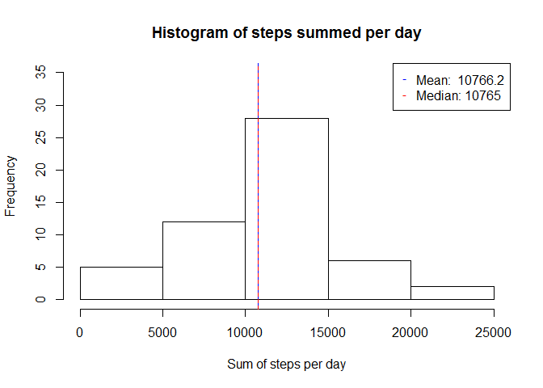
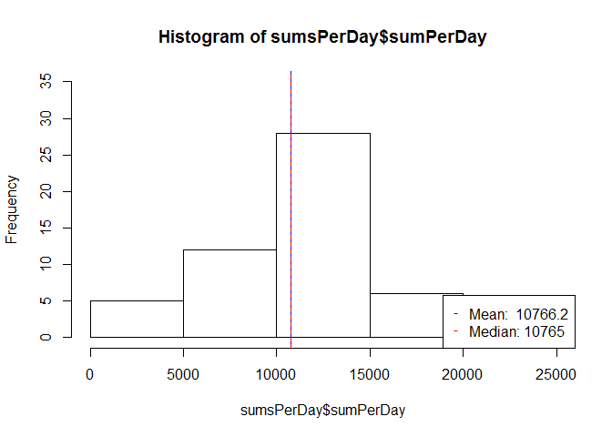
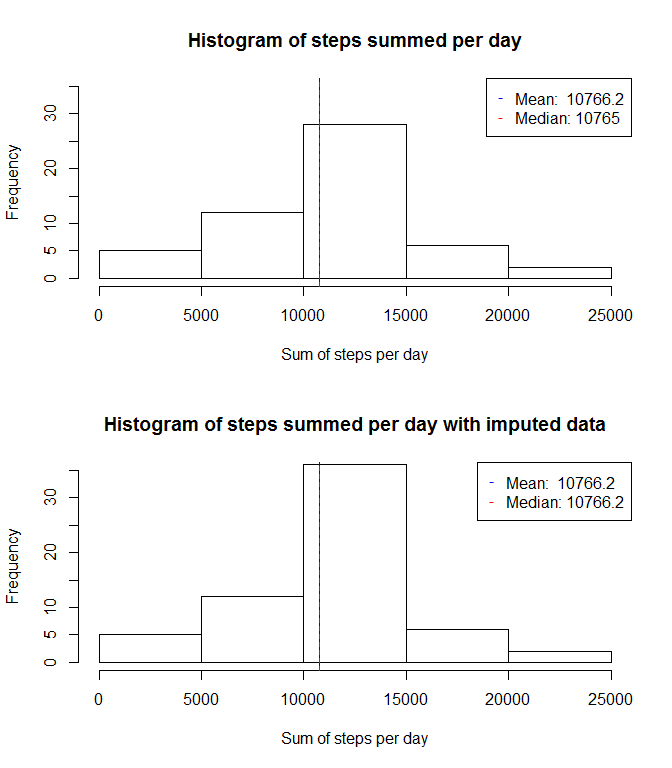
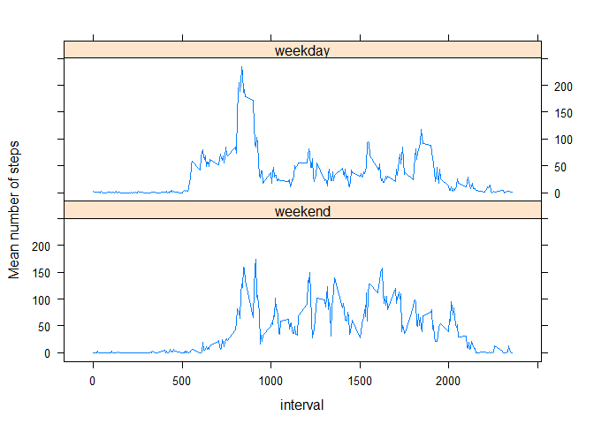

# Reproducible Research: Peer Assessment 1

This R markdown script is the solution for assignment one of the Reproducible research course at Coursera.
The instructions and questions to be answered can be found in the [readme](https://github.com/ThomasMey123/RepData_PeerAssessment1/blob/master/README.md)

## Loading and preprocessing the data
The scipt assumes that you change your working directory to the downloaded files and the zip-File is already downloaded.  
With the following commands the file is unzipped, read and converted to a table.

```r
library(data.table)
```

```
## 
## Attaching package: 'data.table'
## 
## The following object is masked _by_ '.GlobalEnv':
## 
##     .N
```

```r
library(knitr)
opts_chunk$set(echo=TRUE)

unzip("activity.zip", exdir= ".")
md <- read.csv("activity.csv")
md <-data.table(md)
```


## What is mean total number of steps taken per day?


```r
#Since the histogram will be plotted several times with similar parameters a function is defined here for later use 

plotHistoramWithMedianAndMean <- function(m, title) {
    sumsPerDay<-m[, list(sumPerDay=sum(steps)), by=date]

    hist(sumsPerDay$sumPerDay, ylim= c(0,35),xlab="Sum of steps per day", breaks=5, main = title)

    s<-summary(sumsPerDay$sumPerDay,digits=6)

    mean<-s["Mean"]
    median<-s["Median"]

    abline(v=mean,lwd=1,lty=1,col="blue")
    abline(v=median,lwd=1,lty=2,col="red")
    
    legend("topright", 
           pch = "-", 
           col=c("blue","red"), 
           legend=c(paste0("Mean:  ",mean),paste0("Median: ",median)))    
}

# Ignore the missing values
#md<-md[!is.na(md$steps),]
par(mfrow=c(1,1))
plotHistoramWithMedianAndMean(md,"Histogram of steps summed per day")
```

 


## What is the average daily activity pattern?

```r
# The intervals contain gaps, since they are in the format hhmm, e.g. 850,855,900,905
# To get an even spacing of measures against the interval, convert the intervals to hours as floating point numbers

md$hour<- as.integer((md$interval/100)) + (md$interval %% 100)/60 

# sum up and plot the the step sums
meansPerInterval<-md[, list(meanPerInterval=mean(steps,na.rm=TRUE)), by=hour]
plot(meansPerInterval$hour,
     meansPerInterval$meanPerInterval, 
     type="l", 
     xlab="Daytime (hours)", 
     ylab="Mean number of steps",  
     xaxp= c(0,24,8))

# Calculate and plot the maximal interval (=timeslot)
maxIntervalHours<-meansPerInterval[meansPerInterval$meanPerInterval==max(meansPerInterval$meanPerInterval),]
abline(v=maxIntervalHours,lwd=1,lty=1,col="blue")

# To get nicely formatted max interval, just sum up over interval, not hours
meansPerInterval2<-md[, list(meanPerInterval=mean(steps,na.rm=TRUE)), by=interval]
maxInterval<-meansPerInterval2[meansPerInterval2$meanPerInterval==max(meansPerInterval2$meanPerInterval),]

maxInt<- paste(sprintf("%02d",as.integer((maxInterval$interval/100))) , 
               sprintf("%02d",(maxInterval$interval %% 100)) , sep=":")

legend("topright", pch = "-", col=c("blue"), legend=paste0("Maximal number of steps at ",maxInt))
```

 

## Imputing missing values
The strategy for imputing the missing values is to replace it with the average value for the interval calculated in the previous step.  
First let's check the number of NAs.

```r
#calculate the number of NAs
nrow(md[is.na(md$steps),])
```

```
## [1] 2304
```


```r
# in copy table to a new variable 
md2<-md

#merge the means from the previous step to the data table and introduce a new field stepsIsNA
md2<-merge(md2, meansPerInterval2, by="interval")
md2$stepsIsNA<-md2[,is.na(md2$steps)]

#impute the missing values 
md2$steps<-as.numeric(md2$steps)
md2[md2$stepsIsNA]$steps<-md2[md2$stepsIsNA]$meanPerInterval
```

Draw two histograms with the mean and median for the original and imputed data.

```r
#plot a diagram with with and median 
par(mfrow=c(2,1))
plotHistoramWithMedianAndMean(md,"Histogram of steps summed per day")
plotHistoramWithMedianAndMean(md2,"Histogram of steps summed per day with imputed data")
```

 


## Are there differences in activity patterns between weekdays and weekends?


```r
#First set the locale to english
Sys.setlocale("LC_TIME", "English")
```

```
## [1] "English_United States.1252"
```

```r
#As Saturday and Sunday are the only days starting with an "S" use that as discriminator for a boolean
isWeekend<-substr(weekdays(as.Date(md$date)),1,1)=="S"

#add a factor variable  
md$day<- factor( ifelse(isWeekend, "weekend", "weekday"),levels=c("weekend","weekday"))

#Build means and plot
library(lattice)
```

```
## Warning: package 'lattice' was built under R version 3.1.3
```

```r
meansPerInterval<-md[, list(meanPerInterval=mean(steps,na.rm=TRUE)), by=c("interval","day")]
xyplot(meanPerInterval ~ interval | day, 
       data = meansPerInterval, 
       layout= c(1,2),type ="l",   
       ylab="Mean number of steps",  
       xaxp= c(0,24,8))
```

 
  
As required the above uses the interval which causes the straight sections since there are data gaps, e.g. 0850,0855,0900,...  
Nevertheless the figure shows a siginficant difference between weekdays and weekend.


