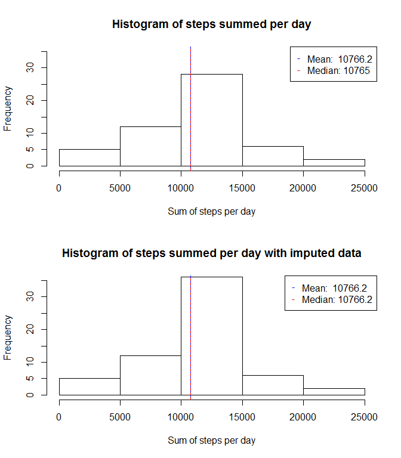
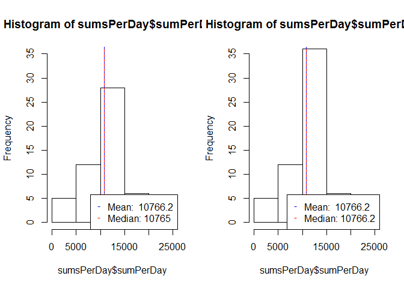

# Reproducible Research: Peer Assessment 1

## define a fuction to plot a histogram with median and mean

```r
plotHistoramWithMedianAndMean <- function(m) {
    sumsPerDay<-m[, list(sumPerDay=sum(steps)), by=date]

    hist(sumsPerDay$sumPerDay, ylim= c(0,35))

    s<-summary(sumsPerDay$sumPerDay,digits=6)

    mean<-s["Mean"]
    median<-s["Median"]

    abline(v=mean,lwd=1,lty=1,col="blue")
    abline(v=median,lwd=1,lty=2,col="red")
    
    legend("bottomright", 
           pch = "-", 
           col=c("blue","red"), 
           legend=c(paste0("Mean:  ",mean),paste0("Median: ",median)))    
}
```


## Loading and preprocessing the data
* The scipt assumes that you changes your working directory to the downloaded files
* Unzip the file, read it as csv and convert the date from factor to a Date

```r
library(data.table)

unzip("activity.zip", exdir= ".")
md <- read.csv("activity.csv")
md <-data.table(md)
```


## What is mean total number of steps taken per day?


```r
# Ignore the missing values
#md<-md[!is.na(md$steps),]
par(mfrow=c(1,1))
plotHistoramWithMedianAndMean(md)
```

 


## What is the average daily activity pattern?


```r
# The intervals contain gaps, since they are in the format hhmm, e.g. 850,855,900,905
# To get an even spacing of measures against the interval, convert the intervals to hours as floating point numbers

md$hour<- as.integer((md$interval/100)) + (md$interval %% 100)/60 

# sum up and plot the the step sums
meansPerInterval<-md[, list(meanPerInterval=mean(steps,na.rm=TRUE)), by=hour]
with(meansPerInterval,(
    plot(hour,meanPerInterval, type="l", xlab="Daytime (hours)", ylab="Mean number of steps",  xaxp= c(0,24,8))))
```

```
## NULL
```

```r
maxIntervalHours<-meansPerInterval[meansPerInterval$meanPerInterval==max(meansPerInterval$meanPerInterval),]
abline(v=maxIntervalHours,lwd=1,lty=1,col="blue")


# To get nicely formatted max interval, just sum up over interval, not hours
meansPerInterval2<-md[, list(meanPerInterval=mean(steps,na.rm=TRUE)), by=interval]
maxInterval<-meansPerInterval2[meansPerInterval2$meanPerInterval==max(meansPerInterval2$meanPerInterval),]

maxInterval$interval
```

```
## [1] 835
```

```r
maxInt<- paste(sprintf("%02d",as.integer((maxInterval$interval/100))) , 
               sprintf("%02d",(maxInterval$interval %% 100)) , sep=":")

legend("topright", pch = "-", col=c("blue"), legend=paste0("Maximal number of steps at ",maxInt))
```

 

## Imputing missing values
The strategy for imputing the missing values is to replace it with the average value for the interval

```r
#calculate the number of NAs
nrow(md[is.na(md$steps),])
```

```
## [1] 2304
```

```r
#merge the means () to make the assignement easiser
md<-merge(md, meansPerInterval2, by="interval")
md$stepsIsNA<-md[,is.na(md$steps)]

md2<-md
md2$steps<-as.numeric(md2$steps)
md2[md2$stepsIsNA]$steps<-md2[md2$stepsIsNA]$meanPerInterval

#plot a diagram with with and median 
par(mfrow=c(1,2))
plotHistoramWithMedianAndMean(md)
plotHistoramWithMedianAndMean(md2)
```

 


## Are there differences in activity patterns between weekdays and weekends?
